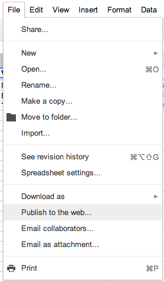
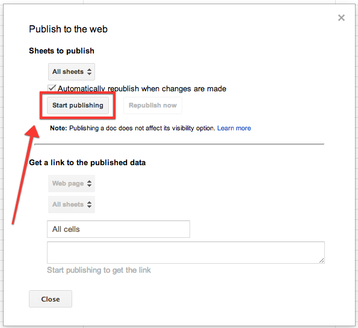

# GoogleDocsBackend

Use a Google Docs Spreadsheet in a style similar to Parse.  You can setup a spreadsheet with all of the data you want, and pull that into your mobile application.  An example spreadsheet can be seen [here](https://docs.google.com/spreadsheet/ccc?key=0Atoge9gLkMCTdENkUkVENElFczlmTDl1ODZWaTJmeFE&usp=sharing).  The concept originated during the development on an app for [Amp Music](http://amp-music.com/).

## Setup

To allow a Google Spreadsheet to be accessed via this library (and API calls), you must Publish it. *Note: Publishing and simply setting as public are two seperate things. See screenshots below*
The first row of cells acts as the keys for the objects fetched from the server, and each row after that is one object.  Values for objects are paired with the keys in row 1.  As such it is highly recommended that you [name and protect](https://support.google.com/drive/answer/63175?hl=en) row 1.

In order to convert these into native NSObects, you need to subclass `GDBModel`, which makes use of [Mantle](https://github.com/MantleFramework/Mantle).  The important part is to implement `+ (NSDictionary *)JSONKeyPathsByPropertyKey` in order to map the column headers to native attributes.  See `GDBExampleShowModel` for a demonstration on how to do this.

Once you have that done, you can call `[GoogleDocsServiceLayer objectsForWorksheetKey: sheetId: modelClass: callback:]` in order to fetch the information from that spreadsheet and convert them into local native objects.  See `GDBExampleViewController`'s `viewDidLoad` for an example.  *Note: Google Docs appears to 1-index their spreadsheets instead of 0-index, so the first sheet in a worksheet would be index `1`*

## Shortcomings

A service like [Parse](https://parse.com/) is far more powerful, this is purely an attempt to have a cheap and free alternative.  Several things Parse can do that this can't at this time:

* Allow client-side creation of objects
* Support pointers/relationships

What it CAN do:

* Support unlimited number of collaborators via sharing the document via Google Drive/Docs to other Google users
* Be free for unlimited API requests

Right now this only works as a read-only, non-relational backend.  If that works for you, hurray!

## Usage

To run the example project; clone the repo, and run `pod install` from the Example directory first.

## Installation

GoogleDocsBackend is available through [CocoaPods](http://cocoapods.org), to install
it simply add the following line to your Podfile:

    pod "GoogleDocsBackend"

## TODOs

- [ ] Handle gaps in cells better
- [ ] Parse header keys via NSRegularExpressions
- [ ] Clean up documentation
- [ ] Enable writing of data
- [ ] Handle BOOLs and NSDates more cleanly
- [ ] Allow accessing of non-attributed values
- [ ] Publish to CocoaPods

## Author

pyro2927, joseph@pintozzi.com

## License

GoogleDocsBackend is available under the GPLv2 license. See the LICENSE file for more info.
